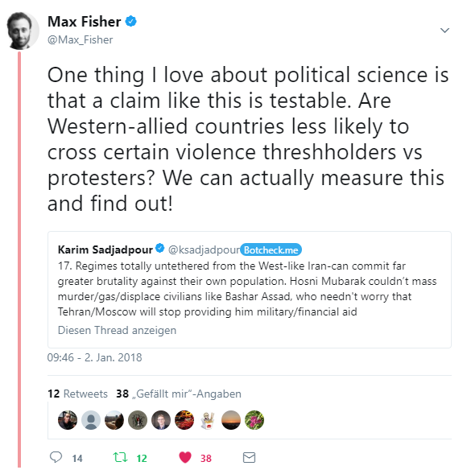

Idea {data-icon="fa-lightbulb-o"}
=====================================

In the course of this little data story we will introduce you to our little project.

This is a story about an interesting tweet that we stumbled upon, pondering on the idea that regimes aligned with the West are more likely to restrain themselves when it comes to repressive measures while countries that are aligned with (Soviet) Russia are more likely to commit violence against their population because they don't have to fear to lose their support. 

<center>
 
</center>


Since we found this very interesting, we decided to actually take on this challenge and find out what the data tells. The first big question that arose was how to measure alignment over time. We decided to webscrape data on arms trade deals from the Stockholm International Peace Research Institute (SIPRI) and took that as a measurement for alignment. Our idea here was that the more Western countries or (Soviet) Russia are exporting weapons to a country, the more likely it is that the buyer is aligned with that country. Admittedly, this seems a bit messy at first but in practice it holds up pretty well. For example, post-Mossadegh Iran until 1979 was aligned with the US and we can observe a lot of weapons trade directed at Iran up until that point.


Storyboard {.storyboard data-icon="fa-line-chart"}
=========================================

```{r}
pacman::p_load(dplyr, haven, stringr, ggplot2)
```


### Freedom from Political Killings - World Map {data-commentary-width=560}

```{r}
data(worldgeojson, package = "highcharter")
load("data/vdem_sub.Rdata")

ds <- vdem %>% 
  rename(iso3 = ctid) %>%
  select(year, iso3, pkill) %>%
  mutate(id = 1:n()) %>%
  group_by(iso3) %>% 
  #split(.$id) # from base R
  do(item = list(
    iso3 = first(.$iso3),
    sequence = .$pkill,
    value = first(.$pkill))
  ) %>% 
  .$item

stops <- data.frame(
  q = 0:5/5,
  c = viridis::viridis(6, option = "A"),
  stringsAsFactors = FALSE
)
stops <- highcharter::list_parse2(stops)


highcharter::highchart(type = "map") %>% 
  highcharter::hc_add_series(
    data = ds,
    name = "drug deaths per 100,000",
    mapData = worldgeojson,
    joinBy = "iso3",
    borderWidth = 0.01
  ) %>% 
  #highcharter::hc_colorAxis(stops = highcharter::color_stops()) %>%  
  highcharter::hc_colorAxis(stops = stops) %>%
  #highcharter::hc_title(text = "How the Epidemic of Drug Overdose Deaths Ripples") %>%
  #  highcharter::hc_legend(layout = "vertical", reversed = TRUE,
  #            floating = TRUE, align = "right") %>% 
  #  highcharter::hc_add_theme(highcharter::hc_theme_smpl()) %>% 
  highcharter::hc_motion(
    enabled = T,
    axisLabel = "year",
    labels = sort(unique(vdem$year)),
    series = 0,
    updateIterval = 50,
    magnet = list(
      round = "floor",
      step = 0.05
    )
  )
```

***

*From the V-Dem Codebook 7.1:*

**Question:**  Is there freedom from political killings? 

**Clarification:**  Political killings are killings by the state or its agents without due process 
of law for the purpose of eliminating political opponents. These killings are the result
of deliberate use of lethal force by the police, security forces, prison officials, or
other agents of the state (including paramilitary groups). 

**Responses:**

0. Not respected by public authorities. Political killings are practiced 
systematically and they are typically incited and approved by top leaders of
government. 

1. Weakly respected by public authorities. Political killings are practiced
frequently and top leaders of government are not actively working to prevent
them. 

2. Somewhat respected by public authorities. Political killings are practiced
occasionally but they are typically not incited and approved by top leaders of
government. 

3. Mostly respected by public authorities. Political killings are practiced in a few
isolated cases but they are not incited or approved by top leaders of
government. 

4. Fully respected by public authorities. Political killings are non-existent.


### World Map by Arms Deals and Super Power {data-commentary-width=560}

```{r}
data(worldgeojson, package = "highcharter")
load("data/nn23.Rdata")
#nn23 %>%
# ggplot(aes(sumperc)) +
# geom_histogram() +
# xlim(-.3,.3)
# 
# ds %>%
#   filter(sumperc > 0.8)
# 
# nn23$cname %in% states %>% table()
# 
# table(nn23$cname) 
states_norm <- c("AUS", "AUT", "BEL", "CAN", "CHE", "CYP", "DEU", "DNK", "ESP", 
"FIN", "FRA", "GBR", "GRC", "IRL", "ISL", "ITA", "NLD", "NOR", 
"NZL", "PRT", "SWE", "USA", "GBR")

ds <- nn23 %>% 
  #rename(iso3 = ctid) %>%
  select(year, iso3, cname, sumperc) %>%
  mutate(id = 1:n()) %>%
  mutate(
    sumperc = ifelse(iso3 %in% states_norm, 1, sumperc), 
    sumperc = ifelse(cname %in% "Russian Federation", -1, sumperc)
  ) %>%
  select(-cname) %>%
  mutate(sumperc = ifelse(sumperc < 0.01 & sumperc > -0.01, 0, sumperc)) %>%
  group_by(iso3) %>% 
  #split(.$id) # from base R
  do(item = list(
    iso3 = first(.$iso3),
    sequence = .$sumperc,
    value = first(.$sumperc))
  ) %>% 
  .$item

stops <- data.frame(
  q = 0:5/5,
  #c = viridis::viridis(6, option = "A"),
  c = RColorBrewer::brewer.pal(6, "RdBu"),
  stringsAsFactors = FALSE
)

stops <- highcharter::list_parse2(stops)

highcharter::highchart(type = "map") %>% 
  highcharter::hc_add_series(
    data = ds,
    name = "drug deaths per 100,000",
    mapData = worldgeojson,
    joinBy = "iso3",
    borderWidth = 0.01
  ) %>% 
  #highcharter::hc_colorAxis(stops = highcharter::color_stops()) %>%  
  highcharter::hc_colorAxis(stops = stops) %>%
  #highcharter::hc_title(text = "How the Epidemic of Drug Overdose Deaths Ripples") %>%
  #  highcharter::hc_legend(layout = "vertical", reversed = TRUE,
  #            floating = TRUE, align = "right") %>% 
  #  highcharter::hc_add_theme(highcharter::hc_theme_smpl()) %>% 
  highcharter::hc_motion(
    enabled = T,
    axisLabel = "year",
    labels = sort(unique(nn23$year)),
    series = 0,
    updateIterval = 50,
    magnet = list(
      round = "floor",
      step = 0.01
    )
  )
```


***

**Legend:**

- -1 stands for 100% of the total export value has been given to that country in that specific year by (Soviet) Russia

- 1 stands for 100% of the total export value has been given to that country in that specific year by Western Countries

**How [trend-indicator-values (TIVs)](https://www.sipri.org/databases/armstransfers/background) are measured.**

SIPRI statistical data on arms transfers relates to actual deliveries of major conventional weapons. To permit comparison between the data on such deliveries of different weapons and to identify general trends, SIPRI has developed a unique system to measure the volume of international transfers of major conventional weapons using a common unit, the trend-indicator value (TIV).

The TIV is based on the known unit production costs of a core set of weapons and is intended to represent the transfer of military resources rather than the financial value of the transfer. Weapons for which a production cost is not known are compared with core weapons based on: size and performance characteristics (weight, speed, range and payload); type of electronics, loading or unloading arrangements, engine, tracks or wheels, armament and materials; and the year in which the weapon was produced. A weapon that has been in service in another armed force is given a value 40 per cent of that of a new weapon. A used weapon that has been significantly refurbished or modified by the supplier before delivery is given a value of 66 per cent of that of a new weapon.


### Freedom from Political Killings by Time and % of Arms Deals of Main Seller {data-commentary-width=560}

```{r}
load("data/final_data.Rdata")
nn <- final_data %>%
  mutate(perc = paste0(round(perc_all*100, 2), " %")) %>%
  mutate(pkill = round(pkill, 2)) %>%
  mutate(color = ifelse(affil == "Western Countries", "#1E90FF", "#CD4F39"))

#devtools::install_github("jbkunst/highcharter", force = T)
library(highcharter)

nn %>%
  mutate(perc_all = round(perc_all, 2)) %>%
  highcharter::hchart("point", 
                      highcharter::hcaes(year, pkill, size = perc_all, color = color, group = color), 
                      maxSize = "5%",
                      minSize = "1%",
                      regression = T,
                      regressionSettings = list(type = "polynomial", order = 5, hideInLegend = T)) %>% 
  highcharter::hc_colors(c("#1E90FF", "#CD4F39")) %>% 
  #highcharter::hc_xAxis(categories = affil) %>%
  #highcharter::hc_legend(labelFormat = c("HAHA", "HAHA2")) %>% 
  highcharter::hc_add_dependency("plugins/highcharts-regression.js") %>%
  highcharter::hc_legend(enabled = F) %>%
  highcharter::hc_title(text = "Arms Trade by Country and Year") %>% 
  highcharter::hc_subtitle(text = "Data ...") %>% 
  #highcharter::hc_tooltip(useHTML = TRUE, headerFormat = "", pointFormat = tltip) %>% 
  highcharter::hc_tooltip(
    headerFormat = "<b>Arms Trade</b><br>",
    pointFormat = "Country: {point.cname} <br>
    Year: {point.year} <br>
    Gov. Violence: {point.pkill} <br>
    Arms Trade (% TIV per Year): {point.perc} <br>
    Seller: {point.affil}
    "
  )
```

*** 

**What can we see on the chart?**

The x-axis shows the years.

The y-axis shows a measurement for "Freedom from Political Killing" based on estimates on how widespread and systematic government violence is (exact measurement in the comments). Higher values indicate more freedom from political killings. Data is taken from the Varieties of Democracies Dataset (Version 7.1).

The dots represent a country in a specific year. The size of the dot and color intensity show the percentage of total arms value that is exported to that specific country. 

The main alignment (red and blue colors) is determined in the following way: if Russia's weapon export value to a certain country exceeds 5% of the total export value in a given year and if the export value is below 1% of US arms exports, that country is tagged as Russian aligned (and the opposite for identifying western alignment). This leaves us with 638 individual country years that can be identified as either being primarily served by Russia or Western countries.

The lines are trend lines (loess-curves), showing the degree of political violence perpetrated by regimes that mainly receive weapons from the West (blue) or (Soviet) Russia (red).


Some commentary about Frame 2.


haha


FAQ {data-navmenu="Info" data-icon="fa-info-circle"}
=========================================


haha

Contact {data-navmenu="Info"}
=========================================


haha


Appendix {data-navmenu="Info"}
=========================================

Row {.tabset .tabset-fade}
-------------------------------------

### Chart 2

```{r}
library(streamgraph)
final_data %>%
  select(year, affil, pkill) %>%
  #tidyr::gather("invest", "value", -year,- affil)
  group_by(affil, year) %>%
  summarise(pkill = sum(pkill, rm.na = T)) %>%
  ungroup() %>%
  filter(!is.na(affil)) %>%
  filter(year >= 1950) %>%
  streamgraph(
    key = "affil", 
    value = "pkill", 
    date = "year", 
    #interactive = T
    scale = "continuous"
  ) %>% 
  sg_axis_x(tick_format="d") %>%
  sg_fill_manual(values = c("#CD4F39", "#1E90FF"))
```   
 
### Chart 3
   
```{r}
library(streamgraph)
final_data %>%
  select(year, affil, ctiv_r, ctiv_w) %>%
  #tidyr::gather("invest", "value", -year,- affil)
  mutate(tiv = ctiv_r + ctiv_w) %>%
  group_by(affil, year) %>%
  summarise(mtiv = sum(tiv, rm.na = T)) %>%
  ungroup() %>%
  filter(!is.na(affil)) %>%
  filter(year >= 1950) %>%
  streamgraph(
    key = "affil", 
    value = "mtiv", 
    date = "year", 
    #interactive = T
    scale = "continuous"
  ) %>% 
  sg_axis_x(tick_format="d") %>%
  sg_fill_manual(values = c("#CD4F39", "#1E90FF"))
``` 

Raw Data {data-navmenu="Info"}
=========================================

```{r}
load("data/armstrades.Rdata")
DT::datatable(armstrades)
```

